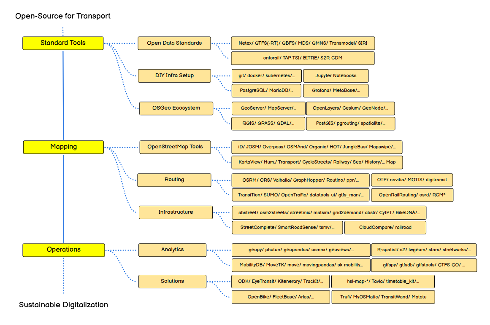
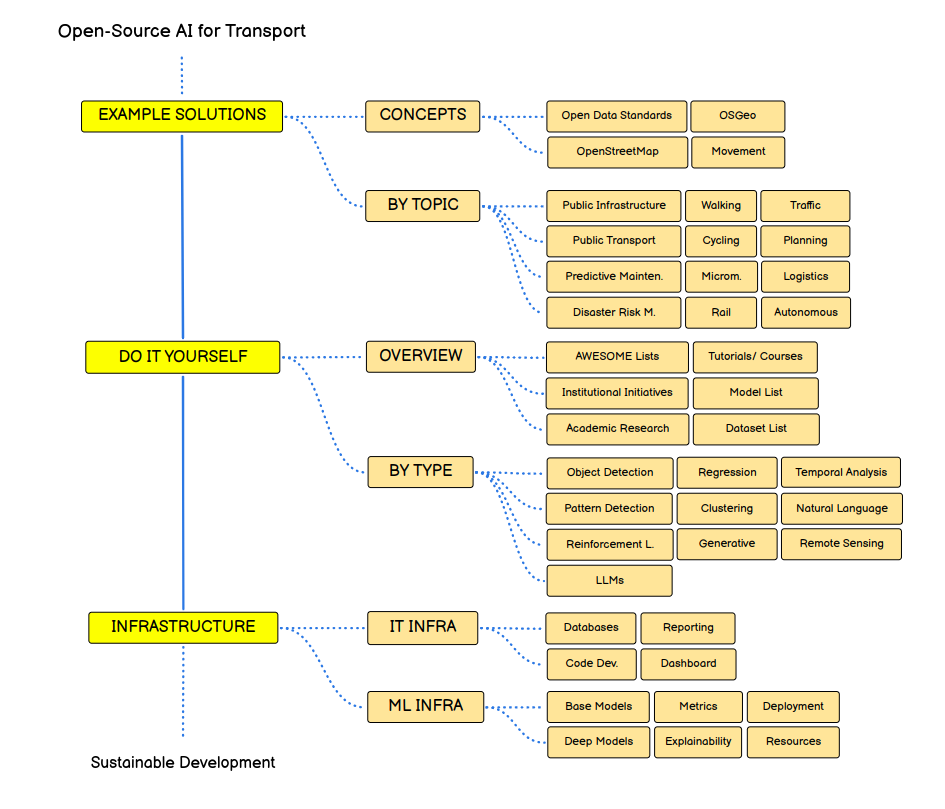

## awesome-open-transport

Awesome resources for Open-Source Software for Transport.

| | | 
| --| --|
|| 
 |

 

- [awesome-open-transport](#awesome-open-transport)
  - [1. Open Data Standards](#1-open-data-standards)
  - [2. OpenStreetMap Ecosystem](#2-openstreetmap-ecosystem)
  - [3. OSGeo Ecosystem](#3-osgeo-ecosystem)
  - [4. Mapping Transport Infrastructure](#4-mapping-transport-infrastructure)
  - [5. Routing](#5-routing)
  - [6. Transport Analytics](#6-transport-analytics)
  - [7. Apps](#7-apps)
  - [8. Miscellanous](#8-miscellanous)
- [Getting Started - Resources](#getting-started---resources)
- [Getting Started - IT Infrastructure](#getting-started---it-infrastructure)
- [AWESOME Resources List](#awesome-resources-list)

 

### 1. Open Data Standards

Open Data Standards are like a common language for different types of transportation, making everything work together smoothly. Think of them as rules that everyone follows to share information easily. These standards help different systems understand each other, allowing for things like real-time updates and better planning.

- Public Transport: [Netex](https://netex-cen.eu/), [GTFS](https://gtfs.org/), [GTFS-RT](https://gtfs.org/realtime/reference/)
- Vehicle sharing: [MDS](https://github.com/openmobilityfoundation/mobility-data-specification), [GBFS](https://github.com/MobilityData/gbfs)
- Network specification: [GMNS](https://github.com/zephyr-data-specs/GMNS)
- Conceptual: [Transmodel](https://github.com/oeg-upm/transmodel-ontology)
- Rail: [Ontorail](https://ontorail.org/), [TAP-TSI](https://tap-tsi.uic.org/), <s>[S2R-CDM]()</s>, <s>[BITRE]()</s>

### 2. OpenStreetMap Ecosystem

The OpenStreetMap ecosystem is a global collaboration where volunteers contribute to create free and open maps for various purposes. Tools like iD and JOSM enable map creation and editing, and Overpass Turbo aids in querying specific data. Mobile apps like OSMAnd, OrganicMaps, and JungleBus make these maps accessible on the go. This collaborative effort makes OpenStreetMap an invaluable resource for transportation, offering detailed, up-to-date information that facilitates route planning, navigation, and community engagement while promoting accessibility and inclusivity.

- Maps:
  - [OpenStreetMap](https://www.openstreetmap.org/)
  - Variations: [Kartaview](https://kartaview.org/landing), [OpenHumanitarianMap]()
  - Railway or Sea: [OpenRailwayMaps](https://www.openrailwaymap.org/), [OpenSeaMap](https://map.openseamap.org/)
  - Historical mapping: [OpenHistoryMap](https://map.openhistorymap.org/), [OpenHistoricalMap](https://www.openhistoricalmap.org/)
  - Aerial: [OpenAerialMap](https://openaerialmap.org/)
- Tools: [iD](https://wiki.openstreetmap.org/wiki/ID), [JOSM](https://josm.openstreetmap.de/)
- Querying: [Overpass Turbo](https://overpass-turbo.eu/)
- Apps: [OSMAnd](https://osmand.net/), [OrganicMaps](https://organicmaps.app/), [JungleBus](https://wiki.openstreetmap.org/wiki/Jungle_Bus_mobile_app)
- Initiative: [HOT-OSM](https://www.hotosm.org/)

### 3. OSGeo Ecosystem

The OSGeo Ecosystem is like a toolbox for making maps and understanding transportation. It's like having all the tools you need to figure out and improve how we move around, making it super useful for anyone working with maps and transportation.

- Server related: [Geoserver](https://geoserver.org/), [Mapserver](https://mapserver.org/), [GeoNode](https://geonode.org/)
- Visuals: [OpenLayers](https://openlayers.org/), [Cesium](https://cesium.com/)
- Applications: [QGIS](https://qgis.org/en/site/), [GRASS GIS](https://grass.osgeo.org/), [GDAL](https://gdal.org/index.html)
- Database related: [PostGIS](https://postgis.net/), [pgRouting](https://pgrouting.org/), [spatialite](https://www.gaia-gis.it/fossil/libspatialite/index)

### 4. Mapping Transport Infrastructure

Mapping transport infrastructure using open-source tools provides professionals with a suite of digital resources. These open-source tools serve as effective digital aids, empowering professionals to efficiently explore and enhance transportation systems across various modes.

- Infrastructure status: [StreetComplete](https://streetcomplete.app/?lang=en), [SmartRoadSense](https://smartroadsense.it/), <s>[tsmv]()</s>, [Mapswipe](https://mapswipe.org/en/)
- Simulation: [abstreet](https://github.com/a-b-street/abstreet), [streetmix](https://github.com/streetmix/streetmix), [matsim](https://www.matsim.org/), [abstr](https://github.com/a-b-street/abstr), [osm2streets](https://github.com/a-b-street/osm2streets)
- Estimations: [grid2demand](https://github.com/asu-trans-ai-lab/grid2demand)
- Cycling: [CyIPT](https://www.cyipt.bike/), [BikeDNA](https://github.com/anerv/BikeDNA)
- Rail: [CloudCompare](https://github.com/cloudcompare/cloudcompare), [railroad](https://github.com/GISLab-ELTE/railroad)
- AI Solutions:
  - [Road Graph Extraction](https://github.com/songtaohe/Sat2Graph)
  - [Crack Instance Segmentation](https://huggingface.co/datasets/fcakyon/crack-instance-segmentation)
  - [Pothole Segmentation](https://huggingface.co/datasets/keremberke/pothole-segmentation)
  - [Road segmentation](https://medium.com/@nithishmailme/satellite-imagery-road-segmentation-ad2964dc3812)
  - [Road Network Classification](https://github.com/ualsg/Road-Network-Classification)
  - [Satellite Crosswalk Classification](https://github.com/rodrigoberriel/satellite-crosswalk-classification)
  - [Segmentation Roads](https://github.com/satellite-image-deep-learning/techniques#28-segmentation---roads) 
  - [Road Detections from Microsoft](https://github.com/microsoft/RoadDetections)

  
### 5. Routing

Routing is a pivotal aspect of transport planning, and open-source tools play a crucial role in facilitating efficient navigation across diverse transportation modes. These open-source tools not only contribute to the efficiency of transport planning but also empower users with the flexibility to choose the most suitable and convenient routes for their journeys.

- Routing Engines: [OSRM](https://project-osrm.org/), [ORS](https://openrouteservice.org/), [Valhalla](https://github.com/valhalla/valhalla), [Graphhopper](https://github.com/graphhopper/graphhopper), [Routino](https://github.com/mauricesvay/Routino), [per pedes routing](https://github.com/motis-project/ppr)
- Multimodal routing: [OTP](https://www.opentripplanner.org/), [Navitia](https://github.com/hove-io/navitia), [MOTIS](https://github.com/motis-project/motis), [digitransit](https://github.com/HSLdevcom/digitransit)
- Rail: [OpenRailRouting](https://github.com/geofabrik/OpenRailRouting), [osrd](https://github.com/osrd-project/osrd)

### 6. Transport Analytics

Choosing open-source tools for transport analytics is a smart move for several reasons. These tools, like geopy, photon, geopandas, and osmnx in Python, or R-spatial, lwgeom, stars, and sfnetworks in R, provide powerful capabilities for understanding and analyzing geographic and transportation data. They're free to use, which is great for saving costs. The best part is that you can look at and even change the code if you want to customize things. This open-source approach makes transport analytics more accessible and flexible for everyone.

- Python analytics: [geopy](https://geopy.readthedocs.io/en/stable/), [photon](https://github.com/komoot/photon), [geopandas](https://github.com/geopandas/geopandas), [osmnx](https://github.com/gboeing/osmnx), [geoviews](https://geoviews.org/)
- R analytics: [R-spatial](https://github.com/r-spatial), [lwgeom](https://r-spatial.github.io/lwgeom/), [stars](https://github.com/r-spatial/stars), [sfnetworks](https://luukvdmeer.github.io/sfnetworks/)
- Mobility analytics: [MobilityDB](https://github.com/MobilityDB/MobilityDB), [MoveTK](https://github.com/movetk/movetk), [MOVE](https://github.com/mschoema/move), [movingpandas](https://github.com/movingpandas/movingpandas), [scikit-mobility](https://github.com/scikit-mobility/scikit-mobility)
- GTFS Analytics: [gtfs_manager](https://github.com/spstreets/gtfs_manager), [gtfspy](https://github.com/CxAalto/gtfspy), [gtfsdb](https://github.com/OpenTransitTools/gtfsdb), [gtfstools](https://github.com/ipeaGIT/gtfstools), [GTFS-GO](https://github.com/MIERUNE/GTFS-GO)
- Simulations
  - Demand estimation: [TransiTion](https://github.com/chairemobilite/transition/)
  - Traffic micro-simulator: [SUMO](https://sumo.dlr.de/docs/index.html)
  - Traffic data: [OpenTraffic](https://github.com/opentraffic)
- Traffic AI Solutions:
  - [Traffic prediction (tutorial)](https://www.kaggle.com/code/amitkarmakar41/traffic-prediction-with-fb-prophet-at-minute-level)
  - [LibCity Traffic Data Processing tool](https://github.com/LibCity/Bigscity-LibCity-Datasets)
  - [Open Traffic Collection](https://github.com/graphhopper/open-traffic-collection)
  - [Traffic prediction code summary](https://github.com/aptx1231/Traffic-Prediction-Open-Code-Summary)
  - [Open Datasets - Traffic Datasets](https://github.com/Psychic-DL/Awesome-Traffic-Agent-Trajectory-Prediction#vehicles-publicly-available-datasets)
- Predictive Maintenance <b>TODO</b>

### 7. Apps 

Various open-source apps contribute significantly to transport analytics, each offering unique features to enhance the understanding and optimization of transportation systems. Kitenerary provides a comprehensive itinerary solution, aiding in the seamless organization and management of travel plans. TrackIt focuses on tracking and monitoring assets, enabling real-time insights into the movement of vehicles or objects. Trufi specializes in public transit information, facilitating the efficient planning of routes and schedules. MyOSMatic offers a tool for creating customized maps, useful for visualizing and analyzing geographic data. TransitWand supports the exploration and analysis of transit networks, aiding in the assessment of public transportation efficiency. These open-source apps collectively contribute to the versatility and effectiveness of transport analytics, providing valuable tools for professionals and enthusiasts alike.

- Apps: [Kitenerary](https://github.com/KDE/kitinerary), [TrackIt](https://github.com/flespi-software/TrackIt), [Trufi](https://github.com/trufi-association), [MyOSMatic](https://print.get-map.org/), [TransitWand](https://github.com/conveyal/transit-wand)
- Show timetable: [datatools-ui](https://github.com/ibi-group/datatools-ui), [hsl-map-*](https://github.com/HSLdevcom), [Tavla](https://github.com/entur/tavla), [timetable_kit](https://github.com/neroden/timetable_kit)
- Platforms: [OpenBike](https://github.com/openbikesensor), [FleetBase](https://github.com/fleetbase/fleetbase), [Arlas](https://github.com/gisaia)

### 8. Miscellanous 

In the realm of open transport, a spectrum of tools addresses diverse fields beyond analytics. Disaster risk management tools prepare for and respond to emergencies, ensuring effective crisis readiness. Flood susceptibility tools focus on understanding and mitigating risks related to flooding. Logistics tools streamline fleet management processes, optimizing the movement of goods and resources. Autonomous systems contribute to the development and testing of self-driving technologies, shaping the future of transportation. Tools for tracking and analyzing multiple modes of transportation enhance our understanding of human mobility. Rail-specific models cater to the optimization of rail transport, showcasing the breadth of applications within the open transport landscape. These tools collectively contribute to fostering innovation and efficiency across various dimensions of transportation.

- Disaster Risk Management:
  - [Crisis Ready](https://www.crisisready.io/publications/)
  - [Flood susceptibility](https://github.com/omarseleem92/Machine_learning_for_flood_susceptibility)
  - [Disaster response](https://github.com/satellite-image-deep-learning/techniques#13-disaster-response)
  - [Human Mobility](https://dl.acm.org/doi/abs/10.1145/2970819)
- Logistics:
  - [Fleetbase](https://github.com/fleetbase/fleetbase)
- Autonomous:
  - [Apollo Scape](https://github.com/ApolloScapeAuto/dataset-api)
- All modes of Transport:
  - [Multicamera Object Tracking](https://github.com/LeonLok/Multi-Camera-Live-Object-Tracking)
  - [OpenTraj](https://github.com/crowdbotp/OpenTraj#publicly-available-datasets)
- PT, Walking, Cycling, Micromobility, Rail specific models <b>#TODO</b>
- LLM
  - [LLM Geo](https://github.com/gladcolor/LLM-Geo)

## Getting Started - Resources

A plethora of online resources is available for those delving into geospatial analysis and transportation-related fields. Initiatives like OpenStreetMap and OSGeo contribute to the open-source geospatial community. Academic research is accessible through journals like GeoAI MDPI and IEEE Transactions on Intelligent Transportation Systems, while groups like TransitLab MIT and Mobility MIT foster collaborative research environments. 

- Basic Geospatial Analysis:
  - [Geospatial Regression](https://geographicdata.science/book/notebooks/11_regression.html)
  - [Geospatial Clustering](https://geographicdata.science/book/notebooks/10_clustering_and_regionalization.html)
- Medium Tutorials:
    - [AI4SM](https://medium.com/ai4sm)
    - [GeoAI](https://medium.com/geoai)
    - [North American Geoscientists Organization](https://medium.com/@northamericangeoscientistsorg)
- Other tutorials:
  - [Intro to Geospatial Regression](https://www.unsiap.or.jp/e-learning/el_material/5_Agri/1507_Literacy_KOR/M3_4_Country_Presentation_Korea.pdf)
- Books:
  - [Geographic Data Science](https://geographicdata.science/book/intro.html)
  - [Sustainability GIS](https://sustainability-gis.readthedocs.io/en/latest/index.html)
- Initiatives:
  - [OpenStreetMap](https://www.openstreetmap.org/#map=12/41.3146/19.7778&layers=T)
  - [OSGeo](https://www.osgeo.org/)
  - [Disaster Mobility Data Network](https://www.crisisready.io/work/disaster-mobility-data-network/), <s> [UN OpenGIS](http://unopengis.org/unopengis/pages/page01.php) </s>
- Model list:
  - [Kaggle Transport](https://www.kaggle.com/search?q=Transport)
- Dataset List:
  - [Transit Land](https://www.transit.land/)
  - [TUMI Data](https://tumidata.org/)
  - [HuggingFace](https://huggingface.co/datasets?search=Transport)
  - [AWESOME Public Datasets](https://github.com/awesomedata/awesome-public-datasets#transportation)
- Academic Research
  - Journals:
    - [GeoAI MDPI](https://www.mdpi.com/journal/applsci/special_issues/GIS_Artificial_Intelligence_Machine_Learning_Deep_Learning)
    - [IEEE Transactions on Intelligent Transportation Systems](https://ieeexplore.ieee.org/xpl/RecentIssue.jsp?punumber=6979)
    - [Journal of Advanced Transportation](https://www.hindawi.com/journals/jat/)
    - [Public Transport](https://link.springer.com/journal/12469/volumes-and-issues)
  - Groups:
    - [TransitLab MIT](https://www.transitlab.mit.edu/)
    - [Mobility MIT](https://mobility.mit.edu/)
    - [MLSM DTU](https://mlsm.man.dtu.dk/)
  - Articles:
    - [Deep Learning Papers Roadmap](https://github.com/floodsung/Deep-Learning-Papers-Reading-Roadmap)
    - [Railway and AI](https://eprints.whiterose.ac.uk/185584/7/1-s2.0-S0968090X22001206-main.pdf) 
  - [Urban Computing Papers](https://github.com/Knowledge-Precipitation-Tribe/Spatio-Temporal-papers/tree/master)

## Getting Started - IT Infrastructure

If individuals wish to construct their own transportation infrastructure, numerous tools are available to assist in the process. These tools encompass various aspects such as version control, collaborative development, data analysis, database management, visualization, and machine learning. Depending on specific needs, users can leverage these tools to tailor and build a customized infrastructure that suits their transportation requirements. The availability of diverse tools offers flexibility for individuals seeking to create their infrastructure for different aspects of transportation solutions.

- DIY Infra Setup
  - Essentials:[git](https://git-scm.com/), [github](https://github.com), [docker](https://www.docker.com/)
  - Reporting: [jupyter notebooks](https://jupyter.org/)
  - Databases: [postgresql](https://www.postgresql.org/), [mariadb](https://mariadb.org/)
  - Dashboards: [Grafana](https://grafana.com/), [Metabase](https://www.metabase.com/)
- ML Infra
  - Base Models: [scikit-learn](https://scikit-learn.org/stable/), [xgboost](https://xgboost.readthedocs.io/en/stable/)
  - Deep Models: [pytorch](https://pytorch.org/), [tensorflow](https://www.tensorflow.org/), [keras](https://keras.io/)
  - Metrics: [sklearn metrics](https://scikit-learn.org/stable/modules/model_evaluation.html)
  - Explainability: [FreeMove Space](https://www.freemove.space/blog/), [shap](https://github.com/shap/shap), [lime](https://github.com/marcotcr/lime)
  - Deployment: [MLFlow](https://mlflow.org/)
  - Resources consumptions

## AWESOME Resources List

- Transit:
  - [AWESOME Transit](https://github.com/CUTR-at-USF/awesome-transit)
- Remote Sensing:
  - [AWESOME Remote Sensing Change Detection](https://github.com/wenhwu/awesome-remote-sensing-change-detection)
  - [AWESOME Satellite Image Deep Learning](https://github.com/satellite-image-deep-learning/techniques)
  - [AWESOME Deep Vision](https://github.com/kjw0612/awesome-deep-vision)
  - [AWESOME Satellite Imagery Datasets](https://github.com/chrieke/awesome-satellite-imagery-datasets)
- Logistics:
  - [AWESOME Supply Chain](https://github.com/Funkmyster/awesome-supply-chain)
- Autonomous:
  - [AWESOME Autonomous Vehicles Material](https://github.com/manfreddiaz/awesome-autonomous-vehicles)
  - [AWESOME Mobility Machine Learning - Korea](https://github.com/zzsza/Awesome-Mobility-Machine-Learning-Contents) 
- General:
  - [AWESOME ML Resources](https://github.com/josephmisiti/awesome-machine-learning#python)
  - [AWESOME Datasets (Transportation)](https://github.com/awesomedata/awesome-public-datasets#transportation)
- Industry:
  - [AWESOME COMPANIES](https://github.com/chrieke/awesome-geospatial-companies)
  - [AWESOME Companies Mobility](https://github.com/arwagiz/AI-Sustainable-Mobility)
- Technical:
  - [AWESOME Trajectory Projections (Auto)](https://github.com/jiachenli94/Awesome-Interaction-Aware-Trajectory-Prediction) 
- Reinforcement Learning:
  - [AWESOME RL](https://github.com/jiachenli94/Awesome-Decision-Making-Reinforcement-Learning)
- Timeseries:
  - [AWESOME Time Series](https://github.com/cuge1995/awesome-time-series)
- Logistics
  - [Supply Chain tools](https://github.com/Funkmyster/awesome-supply-chain)
