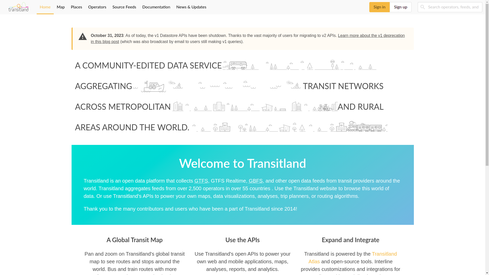
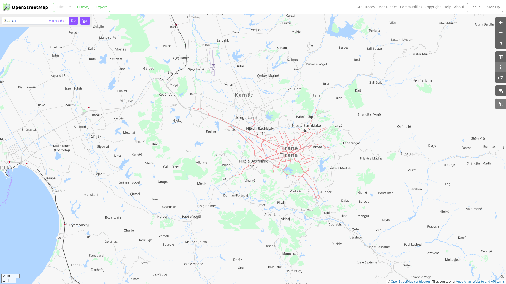
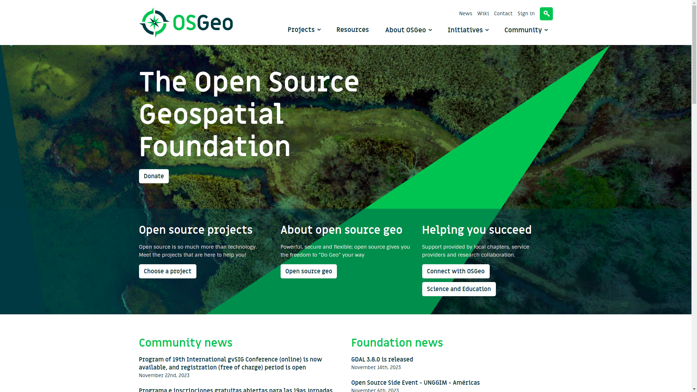
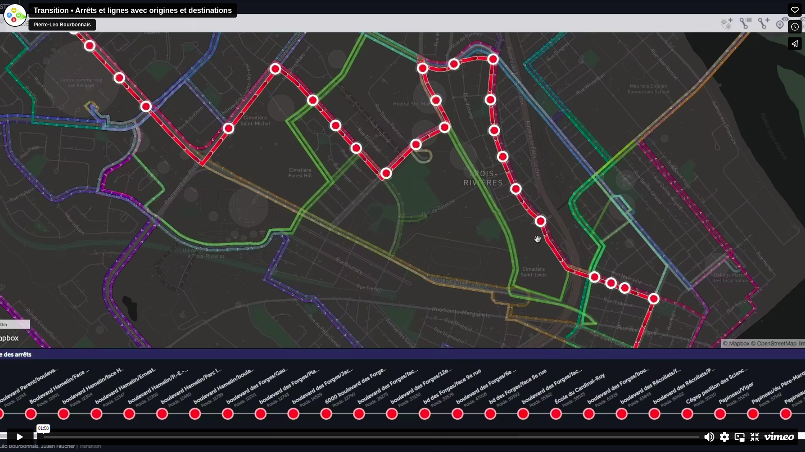
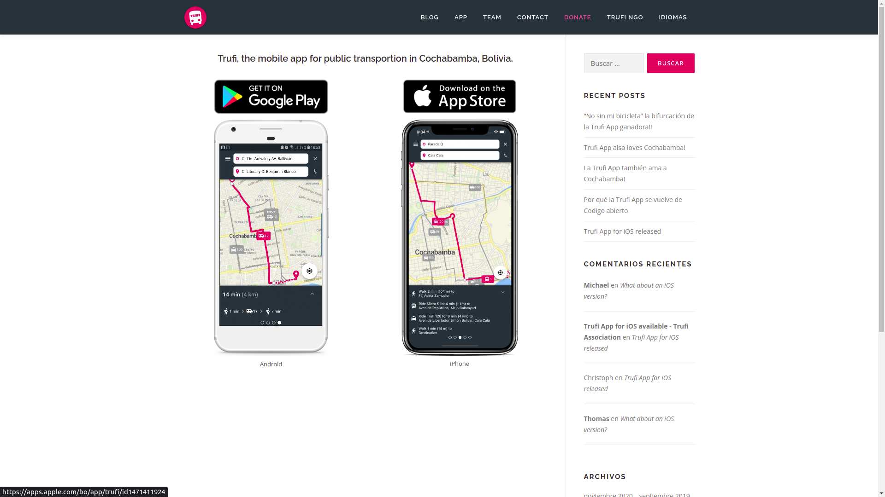

## awesome-open-transport

Awesome resources for Open-Source Software for (mainly public) Transport.

- [awesome-open-transport](#awesome-open-transport)
  - [1. Open Data Standards](#1-open-data-standards)
  - [2. OpenStreetMap Ecosystem](#2-openstreetmap-ecosystem)
  - [3. OSGeo Ecosystem](#3-osgeo-ecosystem)
  - [4. Movement Analytics](#4-movement-analytics)
  - [5. Public Infrastructure](#5-public-infrastructure)
  - [6. Other Tools](#6-other-tools)
  - [7. OS AI](#7-os-ai)
- [Additional Resources](#additional-resources)
  - [Getting Started - IT Infrastructure](#getting-started---it-infrastructure)
  - [Getting Started with Transport AI](#getting-started-with-transport-ai)
  - [AWESOME Resources List](#awesome-resources-list)
  - [Conferences](#conferences)

  

### 1. Open Data Standards
Open Data Standards are like a common language for different types of transportation, making everything work together smoothly. Think of them as rules that everyone follows to share information easily. These standards help different systems understand each other, allowing for things like real-time updates and better planning.

- Standards:
  - Public Transport Standards: [Netex](https://netex-cen.eu/), [GTFS](https://gtfs.org/), [GTFS-RT](https://gtfs.org/realtime/reference/)
  - Vehicle sharing: [MDS](https://github.com/openmobilityfoundation/mobility-data-specification), [GBFS](https://github.com/MobilityData/gbfs)
  - Network specification: [GMNS](https://github.com/zephyr-data-specs/GMNS)
  - Conceptual: [Transmodel](https://github.com/oeg-upm/transmodel-ontology)
  - Rail: [Ontorail](https://ontorail.org/), [TAP-TSI](https://tap-tsi.uic.org/), <s>[S2R-CDM]()</s>, <s>[BITRE]()</s>
- Open Data portals: 
  - [Transitland](https://www.transit.land/) - collection of GTFS worldwide.
  - [Transport Gov FR](https://transport.data.gouv.fr/) - Transport in FR.

 

  
   
  <b>Transitland, collections public transport data.</b>

  

### 2. OpenStreetMap Ecosystem
The OpenStreetMap ecosystem is a global collaboration where volunteers contribute to create free and open maps for various purposes. This collaborative effort makes OpenStreetMap an invaluable resource for transportation, offering detailed, up-to-date information that facilitates route planning, navigation, and community engagement while promoting accessibility and inclusivity.

- Maps:
  - Main: [OpenStreetMap](https://www.openstreetmap.org/)
  - Transport Modes:  [OpenHumanitarianMap](), [OpenRailwayMaps](https://www.openrailwaymap.org/), [OpenSeaMap](https://map.openseamap.org/)
  - Historical mapping: [OpenHistoryMap](https://map.openhistorymap.org/), [OpenHistoricalMap](https://www.openhistoricalmap.org/)
  - Imagery: [Kartaview](https://kartaview.org/landing), [OpenAerialMap](https://openaerialmap.org/)
- Tools:
  - List: [OSM List of Services (GREAT!!)](https://wiki.openstreetmap.org/wiki/List_of_OSM-based_services)
  - Mapping: [iD](https://wiki.openstreetmap.org/wiki/ID), [JOSM](https://josm.openstreetmap.de/), ...
  - Querying: [Overpass Turbo](https://overpass-turbo.eu/)

 

  
   
  <b>OpenStreetMap, the collaboration platform for mapping.</b>

  

### 3. OSGeo Ecosystem
The OSGeo Ecosystem is like a toolbox for making maps and understanding transportation. It's like having all the tools you need to figure out and improve how we move around, making it super useful for anyone working with maps and transportation.

- Tools:
  - Server related: [Geoserver](https://geoserver.org/), [Mapserver](https://mapserver.org/), [GeoNode](https://geonode.org/)
  - Visuals: [OpenLayers](https://openlayers.org/), [Cesium](https://cesium.com/)
  - Applications: [QGIS](https://qgis.org/en/site/), [GRASS GIS](https://grass.osgeo.org/), [GDAL](https://gdal.org/index.html)
  - Database related: [PostGIS](https://postgis.net/), [pgRouting](https://pgrouting.org/), [spatialite](https://www.gaia-gis.it/fossil/libspatialite/index)
- All-in-one: [OSGeo Live](https://live.osgeo.org/en/index.html)

 

  
   
  <b>OSGeo, find your tools here.</b>

  

### 4. Movement Analytics
Choosing open-source tools for movement analytics is a smart move for several reasons. The best part is that you can look at and even change the code if you want to customize things, for example changing some kind of indicator. This open-source approach makes analytics more accessible and flexible for everyone.

- Libraries
  - Python analytics: [geopy](https://geopy.readthedocs.io/en/stable/), [photon](https://github.com/komoot/photon), [geopandas](https://github.com/geopandas/geopandas), [osmnx](https://github.com/gboeing/osmnx), [geoviews](https://geoviews.org/)
  - R analytics: [R-spatial](https://github.com/r-spatial), [lwgeom](https://r-spatial.github.io/lwgeom/), [stars](https://github.com/r-spatial/stars), [sfnetworks](https://luukvdmeer.github.io/sfnetworks/)
  - Mobility analytics: [MobilityDB](https://github.com/MobilityDB/MobilityDB), [MoveTK](https://github.com/movetk/movetk), [MOVE](https://github.com/mschoema/move), [movingpandas](https://github.com/movingpandas/movingpandas), [scikit-mobility](https://github.com/scikit-mobility/scikit-mobility)
  - GTFS Analytics: [gtfs_manager](https://github.com/spstreets/gtfs_manager), [gtfspy](https://github.com/CxAalto/gtfspy), [gtfsdb](https://github.com/OpenTransitTools/gtfsdb), [gtfstools](https://github.com/ipeaGIT/gtfstools), [GTFS-GO](https://github.com/MIERUNE/GTFS-GO)
- Routing:
  - Engines: [OSRM](https://project-osrm.org/), [ORS](https://openrouteservice.org/), [Valhalla](https://github.com/valhalla/valhalla), [Graphhopper](https://github.com/graphhopper/graphhopper), [Routino](https://github.com/mauricesvay/Routino), [per pedes routing](https://github.com/motis-project/ppr)
  - Multimodal routing: [OTP](https://www.opentripplanner.org/), [Navitia](https://github.com/hove-io/navitia), [MOTIS](https://github.com/motis-project/motis), [digitransit](https://github.com/HSLdevcom/digitransit)
  - Rail routing: [OpenRailRouting](https://github.com/geofabrik/OpenRailRouting), [osrd](https://github.com/osrd-project/osrd)
- Simulators:
  - Demand estimation: [TransiTion](https://github.com/chairemobilite/transition/),  [grid2demand](https://github.com/asu-trans-ai-lab/grid2demand)
  - Traffic micro-simulator: [SUMO](https://sumo.dlr.de/docs/index.html)

 

  
   
  <b>Transition, a simulation tool for demand estimation.</b>

  

### 5. Public Infrastructure
Mapping public infrastructure using open-source tools provides professionals with a suite of digital resources. These open-source tools serve as effective digital aids, empowering professionals to efficiently explore and enhance transportation systems across various modes.

- Tools:
  - Infrastructure status: [StreetComplete](https://streetcomplete.app/?lang=en), [SmartRoadSense](https://smartroadsense.it/), <s>[tsmv]()</s>, [Mapswipe](https://mapswipe.org/en/), [MapComplete](https://mapcomplete.org/)
  - Cycling: [CyIPT](https://www.cyipt.bike/), [BikeDNA](https://github.com/anerv/BikeDNA)
  - Rail: [CloudCompare](https://github.com/cloudcompare/cloudcompare), [railroad](https://github.com/GISLab-ELTE/railroad)
- Infrastructure change simlators:
  - Main: [streetmix](https://github.com/streetmix/streetmix), [matsim](https://www.matsim.org/)
  - OSM based: [abstreet](https://github.com/a-b-street/abstreet), [osm2streets](https://github.com/a-b-street/osm2streets), [abstr](https://github.com/a-b-street/abstr)

 

  
   
  <b>StreetComplete, collecting data using OSM.</b>

  

### 6. Other Tools 

Various open-source apps contribute significantly to transport analytics, each offering unique features to enhance the understanding and optimization of transportation systems. For example, Kitenerary provides a comprehensive itinerary solution, aiding in the seamless organization and management of travel plans. Similarly, Trufi specializes in public transit information, facilitating the efficient planning of routes and schedules. 

- Apps:
  - OSM Apps: [OSMAnd](https://osmand.net/), [OrganicMaps](https://organicmaps.app/), [JungleBus](https://wiki.openstreetmap.org/wiki/Jungle_Bus_mobile_app)
  - Different: [Kitenerary](https://github.com/KDE/kitinerary), [TrackIt](https://github.com/flespi-software/TrackIt),[MyOSMatic](https://print.get-map.org/),
  - Public Transport: [Trufi](https://github.com/trufi-association),  [TransitWand](https://github.com/conveyal/transit-wand)
- Display Info:
  - General: [datatools-ui](https://github.com/ibi-group/datatools-ui),  [Tavla](https://github.com/entur/tavla)
  - Timetable: [timetable_kit](https://github.com/neroden/timetable_kit), [hsl-map-*](https://github.com/HSLdevcom), [GTFStoHTML](https://gtfstohtml.com/)
- Management:   
  - Fleet Management: [FleetBase](https://github.com/fleetbase/fleetbase)
  - Operational Management: <s>[Evidenca]()</s>
- Others: 
  - Hardware: [OpenBike](https://github.com/openbikesensor)
  - Analytics: [Arlas](https://github.com/gisaia)

 

  
   
  <b>Trufi App, an application for public transport.</b>

  

### 7. OS AI 

AI applications in transport, particularly those built on open-source frameworks, offer innovative solutions for enhancing efficiency and intelligence in transportation systems. Open-source versions of AI tools provide accessibility and transparency, allowing users to understand, modify, and contribute to the underlying code. From traffic prediction to route optimization, these applications leverage machine learning algorithms and neural networks to analyze vast datasets, improving decision-making processes and overall system performance.

- Geospatial analysis
  - <b>Usecase</b> - Near crash prediction based on street curvature
  - <b>Usecase</b> - Demand estimation based on demographical data 
  - <b>Usecase</b> - [(code) Road Network Classification](https://github.com/ualsg/Road-Network-Classification)
  - <b>Usecase</b> - Distribution of services in the city
  - <b>Usecase</b> - Distribution of public transport in a city
  - <b>Usecase</b> - EV charging station distribution
  - <b>Usecase</b> - Landuse and transport relation
  - <b>Usecase</b> - Safety assessment based on mapped amenities and infrastructure [Link](https://www.kaggle.com/code/hjnotter/using-clustering-to-locate-accident-hotspots)
- Operational optimization
  - <b>Usecase</b> - Delay forecasting, ETA estimations
  - <b>Usecase</b> - Predicting failure of a vehicle (predictive maintenance)
  - <b>Usecase</b> - Best distribution of service for optimizing charging time for EV fleet
  - <b>Usecase</b> - Optimize route for logistics
- Image analysis
  - <b>Usecase</b> - Safety assessment through combination of factors
  - <b>Usecase</b> - Monitor infrastructure using image recognition of traffic signs
  - <b>Usecase</b> - Infrastructure change through drone images
- Video analysis 
  - Models: [YOLO]()
  - Applications:  [(code) Multicamera Object Tracking](https://github.com/LeonLok/Multi-Camera-Live-Object-Tracking)
  - <b>Usecase</b> - Traffic monitoring
  - <b>Usecase</b> - Modal share counting
  - <b>Usecase</b> - Parking spots detections
  - <b>Usecase</b> - Compliance with traffic lights
  - <b>Usecase</b> - Near crash prediction based on video stream
  - <b>Usecase</b> - Automated goods tracing (in logistics)
- Satellite imagery
  - <b>Usecase</b> - [HOTOSM](https://www.hotosm.org/) detecting buildings destroyed pre-disaster
  - <b>Usecase</b> - [(article) Road segmentation](https://medium.com/@nithishmailme/satellite-imagery-road-segmentation-ad2964dc3812)
  - <b>Usecase</b> - [(code) Road Graph Extraction](https://github.com/songtaohe/Sat2Graph)
  - <b>Usecase</b> - [(code) Satellite Crosswalk Classification](https://github.com/rodrigoberriel/satellite-crosswalk-classification)
  - <b>Usecase</b> - Track spatial changes using satellite imaging
  - <b>Usecase</b> - Urban sprawl using historical data
  - <b>Usecase</b> - Climate impact comparison based on historical data 
  - <b>Usecase</b> - Demographical distribution based on historical data
  - <b>Usecase</b> - Vehicle detection from space (e.g. for parking)
  - <b>List</b> -  [(code) Road Segmentation](https://github.com/satellite-image-deep-learning/techniques#28-segmentation---roads) 
- Volume Forecasting 
  - <b>Usecase</b> - Supply forecasting [Link](https://www.kaggle.com/code/aerodinamicc/japanese-cities-and-transport-hubs)
  - <b>Usecase</b> - [(code) Traffic prediction code summary](https://github.com/aptx1231/Traffic-Prediction-Open-Code-Summary) [Link](https://www.kaggle.com/code/ibrahimkaratas/traffic-prediction-for-intelligent-transportation)
  - <b>Usecase</b> - [(article) Traffic prediction at a minute level](https://www.kaggle.com/code/amitkarmakar41/traffic-prediction-with-fb-prophet-at-minute-level)
  - <b>Usecase</b> - Demand estimation for public transport [Link](https://www.kaggle.com/code/hamzaobaid/forecasting-demand-in-public-transportation-system)
  - <b>Usecase</b> - Micromobility demand estimation 
- Autonomous vehicles
  - <b>Usecase</b> - Segment the infrastructure
  - <b>Usecase</b> - Route finding
- Generative AI
  - <b>Usecase</b> - Regenerate a part of the city using common-sensical suggestions
  - <b>Usecase</b> - Redesign a street using technically possible changes
  - <b>Usecase</b> - [(code) LLM Geo - general application](https://github.com/gladcolor/LLM-Geo)
- Customer facing
  - <b>Usecase</b> - Chatbot for taxi company
- Disaster risk management
  - <b>Usecase</b> - Intervention relation with mobility [Link](https://www.kaggle.com/code/achyrogue/impact-of-interventions-through-mobility-data)
- Datasets:
  - [(dataset) Road Detections from Microsoft](https://github.com/microsoft/RoadDetections)
  - [(dataset) Crack Instance Segmentation](https://huggingface.co/datasets/fcakyon/crack-instance-segmentation)
  - [(dataset) Pothole Segmentation](https://huggingface.co/datasets/keremberke/pothole-segmentation)
  - [(dataset) LibCity Traffic Data Processing tool](https://github.com/LibCity/Bigscity-LibCity-Datasets)
  - [(dataset) Open Traffic Collection](https://github.com/graphhopper/open-traffic-collection)
  - [(dataset) Vehicles Trajectory](https://github.com/Psychic-DL/Awesome-Traffic-Agent-Trajectory-Prediction#vehicles-publicly-available-datasets)

  

## Additional Resources

### Getting Started - IT Infrastructure

These tools encompass various aspects such as version control, collaborative development, data analysis, database management, visualization, and machine learning. Depending on specific needs, users can leverage these tools to tailor and build a customized infrastructure that suits their transportation requirements.

- DIY Infra Setup
  - Essentials: [git](https://git-scm.com/), [github](https://github.com), [docker](https://www.docker.com/)
  - Reporting: [jupyter notebooks](https://jupyter.org/)
  - Databases: [postgresql](https://www.postgresql.org/), [mariadb](https://mariadb.org/)
  - Dashboards: [Grafana](https://grafana.com/), [Metabase](https://www.metabase.com/)
- ML Infra
  - Base Models: [scikit-learn](https://scikit-learn.org/stable/), [xgboost](https://xgboost.readthedocs.io/en/stable/)
  - Deep Models: [pytorch](https://pytorch.org/), [tensorflow](https://www.tensorflow.org/), [keras](https://keras.io/)
  - Metrics: [sklearn metrics](https://scikit-learn.org/stable/modules/model_evaluation.html)
  - Explainability: [FreeMove Space](https://www.freemove.space/blog/), [shap](https://github.com/shap/shap), [lime](https://github.com/marcotcr/lime)
  - Deployment: [MLFlow](https://mlflow.org/)
  - Resources consumptions

  

### Getting Started with Transport AI

A plethora of online resources is available for those delving into geospatial analysis and transportation-related fields. Initiatives like OpenStreetMap and OSGeo contribute to the open-source geospatial community. Academic research is accessible through journals like GeoAI MDPI and IEEE Transactions on Intelligent Transportation Systems, while groups like TransitLab MIT and Mobility MIT foster collaborative research environments. 

- Basic Geospatial Analysis:
  - [Geospatial Regression](https://geographicdata.science/book/notebooks/11_regression.html)
  - [Geospatial Clustering](https://geographicdata.science/book/notebooks/10_clustering_and_regionalization.html) 
- Medium Tutorials: [AI4SM](https://medium.com/ai4sm), [GeoAI](https://medium.com/geoai), [NAGorg](https://medium.com/@northamericangeoscientistsorg)
- Books: [Geographic Data Science](https://geographicdata.science/book/intro.html), [Sustainability GIS](https://sustainability-gis.readthedocs.io/en/latest/index.html)
- Model list: [Kaggle Transport](https://www.kaggle.com/search?q=Transport)
- Dataset List: [Transit Land](https://www.transit.land/), [TUMI Data](https://tumidata.org/), [HuggingFace](https://huggingface.co/datasets?search=Transport), [AWESOME Public Datasets](https://github.com/awesomedata/awesome-public-datasets#transportation)
- Academic Research
  - Journals:
    - [GeoAI MDPI](https://www.mdpi.com/journal/applsci/special_issues/GIS_Artificial_Intelligence_Machine_Learning_Deep_Learning)
    - [IEEE Transactions on Intelligent Transportation Systems](https://ieeexplore.ieee.org/xpl/RecentIssue.jsp?punumber=6979)
    - [Journal of Advanced Transportation](https://www.hindawi.com/journals/jat/)
    - [Public Transport](https://link.springer.com/journal/12469/volumes-and-issues)
  - Groups: [TransitLab MIT](https://www.transitlab.mit.edu/), [Mobility MIT](https://mobility.mit.edu/), [MLSM DTU](https://mlsm.man.dtu.dk/)
  - Articles: [Deep Learning Papers Roadmap](https://github.com/floodsung/Deep-Learning-Papers-Reading-Roadmap), [Railway and AI](https://eprints.whiterose.ac.uk/185584/7/1-s2.0-S0968090X22001206-main.pdf), [Urban Computing Papers](https://github.com/Knowledge-Precipitation-Tribe/Spatio-Temporal-papers/tree/master)
- Disaster Risk Management: [HOT-OSM](https://www.hotosm.org/), [Crisis Ready](https://www.crisisready.io/publications/), [Flood susceptibility](https://github.com/omarseleem92/Machine_learning_for_flood_susceptibility), [Disaster response](https://github.com/satellite-image-deep-learning/techniques#13-disaster-response)

  

### AWESOME Resources List

- Transit:
  - [AWESOME Transit](https://github.com/CUTR-at-USF/awesome-transit)
- Remote Sensing:
  - [AWESOME Remote Sensing Change Detection](https://github.com/wenhwu/awesome-remote-sensing-change-detection)
  - [AWESOME Satellite Image Deep Learning](https://github.com/satellite-image-deep-learning/techniques)
  - [AWESOME Deep Vision](https://github.com/kjw0612/awesome-deep-vision)
  - [AWESOME Satellite Imagery Datasets](https://github.com/chrieke/awesome-satellite-imagery-datasets)
- Logistics:
  - [AWESOME Supply Chain](https://github.com/Funkmyster/awesome-supply-chain)
- Autonomous:
  - [AWESOME Autonomous Vehicles Material](https://github.com/manfreddiaz/awesome-autonomous-vehicles)
  - [AWESOME Mobility Machine Learning - Korea](https://github.com/zzsza/Awesome-Mobility-Machine-Learning-Contents) 
- General:
  - [AWESOME ML Resources](https://github.com/josephmisiti/awesome-machine-learning#python)
  - [AWESOME Datasets (Transportation)](https://github.com/awesomedata/awesome-public-datasets#transportation)
- Industry:
  - [AWESOME COMPANIES](https://github.com/chrieke/awesome-geospatial-companies)
  - [AWESOME Companies Mobility](https://github.com/arwagiz/AI-Sustainable-Mobility)
- Technical:
  - [AWESOME Trajectory Projections (Auto)](https://github.com/jiachenli94/Awesome-Interaction-Aware-Trajectory-Prediction) 
- Reinforcement Learning:
  - [AWESOME RL](https://github.com/jiachenli94/Awesome-Decision-Making-Reinforcement-Learning)
- Timeseries:
  - [AWESOME Time Series](https://github.com/cuge1995/awesome-time-series)
- Logistics
  - [Supply Chain tools](https://github.com/Funkmyster/awesome-supply-chain)

  

### Conferences

- [SOTM](https://stateofthemap.org/) - conference on OpenStreetMap and related ecosystem
  - [List of Events](https://wiki.openstreetmap.org/wiki/State_of_the_Map), present in Africa, Asia, EU, and more
  - <b>TODO</b>
- [FOSS4G](https://foss4g.org/) - conference on OSGeo and related ecosystem
  - <b>TODO</b>
- [FOSDEM](https://fosdem.org/)
  - <b>TODO</b>

